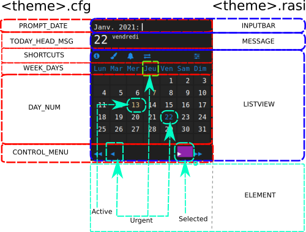

Customize
=========

.. include:: ../README.rst
   :start-after: .. _customize:
   :end-before: .. _files:

In brief
^^^^^^^^

Here is an overview of properties that can be edited in .cfg and .rasi files :

Example
^^^^^^^

.. literalinclude:: ../src/themes/classic_dark.cfg
   :language: ini
