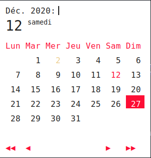

======
Themes
======

Some themes are avaible for example,
As rofi window size can change along themes, you will sometime have to adjust avaible user parameters in naivecalendar.py (week day name length in header for example)

You can apply themes with the command line optioh **-t** or **--theme** with file name (without extention) as argument.
Themes files reside in naivecalendar/themes/ folder. Classic dark is the default one.

Classic dark & light
--------------------

|classic dark| |classic light|

Classic dark & light : compact
------------------------------

|classic dark compact| |classic light compact|

Nord : Round light & Square dark 
--------------------------------

|round light nord| |square dark nord|

.. |classic dark| image:: ../naivecalendar/themes/screenshots/classic_dark.png
    :height: 180px

.. |classic dark compact| image:: ../naivecalendar/themes/screenshots/classic_dark_compact.png
    :height: 180px

.. |classic light compact| image:: ../naivecalendar/themes/screenshots/classic_light_compact.png
    :height: 180px

