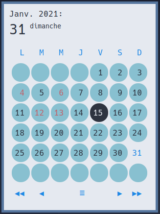
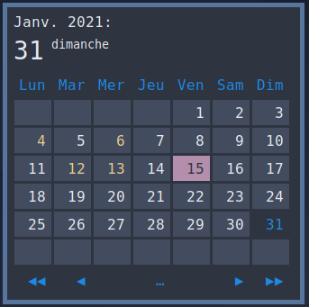
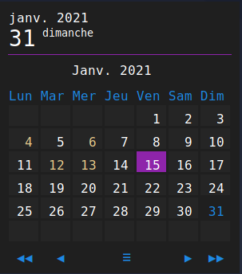
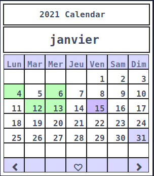

Themes
======

Some themes are avaible for example,
As rofi window size can change along themes, you will sometime have to adjust avaible user parameters in naivecalendar.py (week day name length in header for example)

Themes files are `.rasi <https://github.com/davatorium/rofi/blob/next/doc/rofi-theme.5.markdown>`_ files and reside in *naivecalendar/themes/* folder.

To apply theme :

- set command line optioh **-t** or **--theme** with file name (without extention) as argument.
- overwrite default.rasi file

Inspirations:

 - `nordtheme <https://www.nordtheme.com/>`_
 - `polybar-themes <https://github.com/adi1090x/polybar-themes>`_
 - own interpretarion

Dark & Light : classic, extended, variant
-----------------------------------------

|classic dark| |classic light| 

|classic dark extended| |classic light extended| 

|classic dark variant|

Compact
-------

|classic dark compact| |classic light compact| |retro blue compact| 

Nord : round & square
---------------------

|round light nord| |square dark nord| 

Misc : paper-float & lead pencil & blackboard
---------------------------------------------

|paper-float| |lead pencil| |blackboard|

.. |classic dark| image:: ./screenshots/classic_dark.png
    :height: 220px

.. |classic light| image:: ./screenshots/classic_light.png
    :height: 220px
    :alt: classic light

.. |classic dark compact| image:: ./screenshots/classic_dark_compact.png
    :height: 140px
    :alt: classic dark compact

.. |classic light compact| image:: ./screenshots/classic_light_compact.png
    :height: 140px
    :alt: classic light compact

.. |classic dark extended| image:: ./screenshots/classic_dark_extended.png
    :height: 220px
    :alt: classic dark extended

.. |classic light extended| image:: ./screenshots/classic_light_extended.png
    :height: 220px
    :alt: classic light extended

.. |material darker| image::  ./screenshots/material_darker.png
    :height: 220px
    :alt: material_darker

.. |paper-float| image::  ./screenshots/paper-float.png
    :height: 220px

.. |retro blue compact| image::  ./screenshots/retro_blue_compact.png
    :height: 140px

.. |blackboard| image::  ./screenshots/blackboard.png
    :height: 220px

