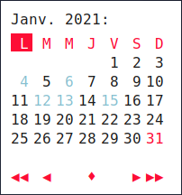
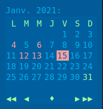

Themes
======

Some themes are avaible for example,
As rofi window size can change along themes, you will sometime have to adjust avaible user parameters in naivecalendar.py (week day name length in header for example)

Themes files are `.rasi <https://github.com/davatorium/rofi/blob/next/doc/rofi-theme.5.markdown>`_ files and reside in *naivecalendar/themes/* folder.

To apply theme :

- set command line optioh **-t** or **--theme** with file name (without extention) as argument.
- overwrite default.rasi file

Inspirations:

 - `nordtheme <https://www.nordtheme.com/>`_
 - `polybar-themes <https://github.com/adi1090x/polybar-themes>`_
 - own interpretarion

Classic dark & light
--------------------

|classic dark| |classic light|

Classic dark & light : compact
------------------------------

|classic dark compact| |classic light compact|

Classic dark & light : extended
-------------------------------

|classic dark extended| |classic light extended|

Nord : Round light & Square dark 
--------------------------------

|round light nord| |square dark nord|

Miscellaneous
-------------

Classic dark variant
^^^^^^^^^^^^^^^^^^^^

|classic_dark_variant| 

Material darker
^^^^^^^^^^^^^^^

|material_darker|

Paper-float
^^^^^^^^^^^

|paper-float| 

Retro blue : Compact
^^^^^^^^^^^^^^^^^^^^

|retro_blue_compact|

.. |classic dark| image:: ./screenshots/classic_dark.png
    :height: 180px

.. |classic light| image:: ./screenshots/classic_light.png
    :height: 180px

.. |classic dark compact| image:: ./screenshots/classic_dark_compact.png
    :height: 180px

.. |round light nord| image:: ./screenshots/round_light_nord.png
    :height: 180px

.. |square dark nord| image:: ./screenshots/square_dark_nord.png
    :height: 180px

.. |classic_dark_variant| image::  ./screenshots/classic_dark_variant.png
    :height: 180px

.. |material_darker| image::  ./screenshots/material_darker.png
    :height: 180px

.. |paper-float| image::  ./screenshots/paper-float.png
    :height: 180px

