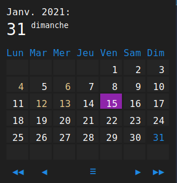
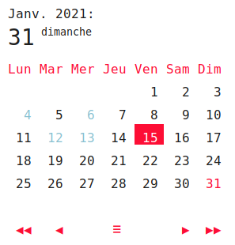
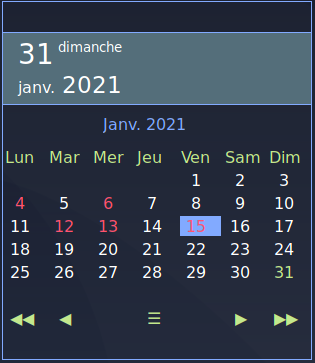
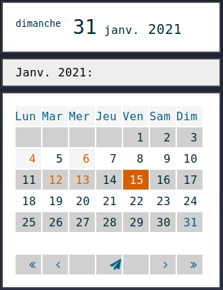
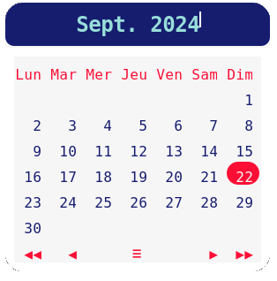
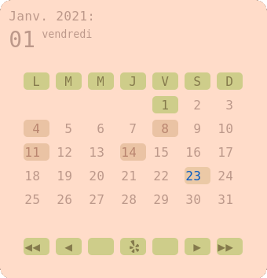
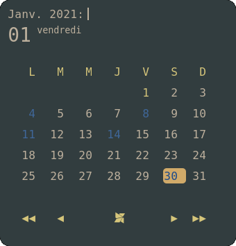

Themes
======

Those are official/example themes

To apply a theme :

- go to menu > swith theme
- set command line optioh **-t** or **--theme** with file name (without extention) as argument.

Sources & Inspirations:

- `nordtheme <https://www.nordtheme.com/>`_
- `polybar-themes <https://github.com/adi1090x/polybar-themes>`_
- `themes by ZB652 <https://www.deviantart.com/zb652>`_

Dark & Light : classic, extended, variant
-----------------------------------------

|classic dark| |classic light| 

|classic dark extended| |classic light extended| 

|classic dark variant| |classic light variant|

Compact : dark, light, retro-blue
---------------------------------

|classic dark compact| |classic light compact| |retro blue compact| 

Nord : round & square
---------------------

|round light nord| |square dark nord| 

Modern : blue & wedgewood
-------------------------

|modern blue| |modern wedgewood|

Magnolia, carbon gold, pastel blue & slate
------------------------------------------

|magnolia| |carbon gold| |pastel blue| |slate|

Misc : paper-float, lead pencil, blackboard & material
------------------------------------------------------

|paper-float| |lead pencil| |blackboard| |material darker|

.. |classic dark compact| image:: ./screenshots/classic_dark_compact.png
    :height: 110px
    :alt: classic dark compact

.. |classic light compact| image:: ./screenshots/classic_light_compact.png
    :height: 110px
    :alt: classic light compact

.. |classic dark extended| image:: ./screenshots/classic_dark_extended.png
    :height: 170px
    :alt: classic dark extended

.. |classic light extended| image:: ./screenshots/classic_light_extended.png
    :height: 170px
    :alt: classic light extended

.. |round light nord| image:: ./screenshots/round_light_nord.png
    :height: 170px
    :alt: round light nord

.. |square dark nord| image:: ./screenshots/square_dark_nord.png
    :height: 170px
    :alt: square dark nord

.. |classic dark variant| image::  ./screenshots/classic_dark_variant.png
    :height: 170px
    :alt: classic_dark_variant

.. |retro blue compact| image::  ./screenshots/retro_blue_compact.png
    :height: 110px

.. |lead pencil| image::  ./screenshots/lead_pencil.png
    :height: 170px

